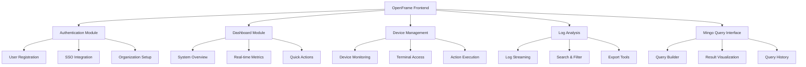

# 🚀 OpenFrame Frontend Development Guide

[](https://nextjs.org/)
[](https://react.dev/)
[](https://typescriptlang.org/)
[](./ui-kit)
[](#)

> **💡 This guide provides comprehensive instructions for Claude Code (claude.ai/code) when working with the OpenFrame Frontend service.**

---

## 📋 Table of Contents

- [🎯 Quick Start](#-quick-start)
- [🏗️ Project Architecture](#️-project-architecture)
- [🛠️ Essential Commands](#️-essential-commands)
- [🎨 UI-Kit Integration](#-ui-kit-integration)
- [♿ Accessibility Standards](#-accessibility-standards)
- [🔧 Development Patterns](#-development-patterns)
- [🧪 Testing & Deployment](#-testing--deployment)
- [🔍 Troubleshooting](#-troubleshooting)

<details>
<summary>🔍 <strong>Quick Search Index</strong></summary>

### 📚 Find What You Need Instantly

| Topic | Section | Keywords |
|-------|---------|----------|
| **🏁 Getting Started** | [Quick Start](#-quick-start) | setup, install, environment, first run |
| **🎨 UI Components** | [UI-Kit Integration](#-ui-kit-integration) | components, button, card, modal, accessibility |
| **🔧 Development** | [Development Patterns](#-development-patterns) | hooks, state, API, GraphQL, authentication |
| **🧪 Testing** | [Testing & Deployment](#-testing--deployment) | unit tests, integration, accessibility testing |
| **🐛 Debugging** | [Troubleshooting](#-troubleshooting) | errors, fixes, debugging, common issues |
| **🛠 Tools** | [Integrated Tools](#-integrated-tools--external-services) | RMM, MeshCentral, Fleet MDM, Authentik |
| **📊 Performance** | [Performance Optimization](#-performance-optimization) | optimization, bundle size, React.memo |

**💡 Quick Tip**: Use `Ctrl/Cmd + F` with keywords above to instantly jump to relevant sections.

</details>

---

## 🎯 Quick Start

OpenFrame Frontend is a **Next.js 15 client-side application** serving as the comprehensive web interface for the OpenFrame platform. Built with modern web standards and accessibility in mind.

### 🚀 Core Features

- **🔐 Authentication**: Multi-provider SSO with organization setup
- **📱 Device Management**: Real-time monitoring and control
- **📊 Log Analysis**: Advanced log streaming and analysis
- **🔍 Mingo Query Interface**: MongoDB-like query builder
- **📈 Dashboard**: Centralized system monitoring

### ⚡ Quick Setup

```bash
# 1. Install dependencies
npm install

# 2. Configure environment
echo "NEXT_PUBLIC_API_URL=http://localhost/api" >> .env.local
echo "NEXT_PUBLIC_CLIENT_ID=openframe_web_dashboard" >> .env.local
echo "NEXT_PUBLIC_CLIENT_SECRET=prod_secret" >> .env.local

# 3. Start development
npm run dev
```

**🌐 Access:** [http://localhost:3000](http://localhost:3000)

---

## 🏗️ Project Architecture

### 📊 Technology Stack

<details>
<summary><strong>📦 Core Technologies</strong></summary>

| Technology | Version | Purpose |
|------------|---------|---------|
| **Next.js** | 15.x | Framework & Routing |
| **React** | 19.x | UI Library |
| **TypeScript** | 5.8.x | Type Safety |
| **Zustand** | 5.0.8 | State Management |
| **Apollo Client** | 3.8.x | GraphQL Client |
| **@flamingo/ui-kit** | Latest | Design System |
| **Tailwind CSS** | 3.4.x | Styling |
| **xterm.js** | 5.3.x | Terminal Interface |

</details>

### 🏢 Application Modules



### 📁 Project Structure

<details>
<summary><strong>🗂️ Directory Structure</strong></summary>

```
openframe-frontend/
├── 📁 src/
│   ├── 📁 app/                          # Next.js App Router
│   │   ├── 📁 auth/                     # 🔐 Authentication Module
│   │   │   ├── 📁 components/           # Auth-specific components
│   │   │   ├── 📁 hooks/                # Auth hooks (useAuth, useToken)
│   │   │   ├── 📁 stores/               # Auth state management
│   │   │   ├── 📄 page.tsx              # /auth route
│   │   │   └── 📄 layout.tsx            # Auth layout
│   │   ├── 📁 dashboard/                # 📊 Main Dashboard
│   │   ├── 📁 devices/                  # 📱 Device Management
│   │   │   ├── 📁 [deviceId]/           # Dynamic device routes
│   │   │   ├── 📁 components/           # Device components
│   │   │   └── 📁 tabs/                 # Device tab navigation
│   │   ├── 📁 logs-page/                # 📄 Log Analysis
│   │   ├── 📁 log-details/              # 🔍 Detailed Log View
│   │   ├── 📁 mingo/                    # 🔍 MongoDB Query Interface
│   │   │   ├── 📁 components/           # Query components
│   │   │   └── 📁 tabs/                 # Query tab navigation
│   │   ├── 📁 components/               # 🔧 Shared app components
│   │   ├── 📁 hooks/                    # 🪝 App-level hooks
│   │   ├── 📄 layout.tsx                # Root layout
│   │   └── 📄 page.tsx                  # Root redirect
│   ├── 📁 stores/                       # 🗃️ Global Zustand stores
│   │   ├── 📄 devices-store.ts          # Device management state
│   │   └── 📄 index.ts                  # Store exports
│   └── 📁 lib/                          # 🛠️ Utilities & config
│       ├── 📁 platform-configs/         # Platform configurations
│       ├── 📄 api-client.ts             # API client setup
│       └── 📄 utils.ts                  # Utility functions
├── 📁 public/                           # 🌐 Static assets
├── 📁 ui-kit/                           # 🎨 Design system (symlink)
├── 📄 next.config.mjs                   # ⚙️ Next.js config
├── 📄 tailwind.config.js                # 🎨 Tailwind config
├── 📄 tsconfig.json                     # 📝 TypeScript config
└── 📄 package.json                      # 📦 Dependencies
```

</details>

---

## 🛠️ Essential Commands

### 🏃‍♂️ Development Commands

| Command | Purpose | Environment |
|---------|---------|-------------|
| `npm run dev` | Start development server | Port 3000 |
| `npm run dev:auth` | Auth-only mode | Development |
| `npm run dev:full` | Full application mode | Development |
| `npm run build` | Production build | Static export |
| `npm run start` | Production server | Port 3000 |
| `npm run lint` | Code quality check | Development |
| `npm run type-check` | TypeScript validation | Development |

### 🔧 Environment Configuration

<details>
<summary><strong>⚙️ Environment Variables</strong></summary>

#### 🎯 Required Variables

```bash
# API Configuration (Kubernetes cluster - most common)
NEXT_PUBLIC_API_URL=http://localhost/api
NEXT_PUBLIC_CLIENT_ID=openframe_web_dashboard
NEXT_PUBLIC_CLIENT_SECRET=prod_secret

# App Mode Configuration
NEXT_PUBLIC_APP_MODE=full-app           # Default: full application
NEXT_PUBLIC_APP_MODE=auth-only          # Auth components only

# Optional Development Features
NEXT_PUBLIC_ENABLE_DEV_TICKET_OBSERVER=true
```

#### 🏠 Local Development

```bash
# For local backend services
NEXT_PUBLIC_API_URL=http://localhost:8100/api
```

</details>

### 🚀 UI-Kit Setup

```bash
# Navigate to UI-Kit directory
cd ui-kit

# Install UI-Kit dependencies
npm install

# Verify UI-Kit build
npm run type-check
```

---

## 🎨 UI-Kit Integration

> **🎯 @flamingo/ui-kit** provides **328+ components** built on Radix UI primitives with platform-aware theming, accessibility features, and OpenFrame-specific styling.

### 📚 Component Usage Guidelines

<div align="center">

**🚨 MANDATORY RULE**
> All UI components MUST come from @flamingo/ui-kit. Custom UI components are only allowed for business logic that wraps UI-Kit components.

</div>

### 📦 Essential Imports

<details>
<summary><strong>🔥 Core Imports Template</strong></summary>

```typescript
// 🎨 Required: Import styles first for proper CSS loading
import '@flamingo/ui-kit/styles'

// 🧩 Core UI Components (most commonly used)
import {
  Button,                    // 12 variants available
  Card,                      // Flexible container component
  CardHeader,                // Card header section
  CardContent,               // Card content area
  CardFooter,                // Card footer section
  Input,                     // Form input with validation
  Textarea,                  // Multi-line text input
  Label,                     // Accessible form labels
  Checkbox,                  // Boolean input control
  Switch,                    // Toggle switch control
  Badge,                     // Status indicators
  Alert,                     // Notification component
  AlertDescription,          // Alert content
  Dialog,                    // Modal dialog system
  DialogContent,             // Dialog content container
  DialogHeader,              // Dialog header section
  DialogTitle,               // Dialog title
  DialogDescription,         // Dialog description
  DialogFooter,              // Dialog footer actions
  DialogTrigger,             // Dialog trigger button
  Tabs,                      // Tab navigation system
  TabsList,                  // Tab navigation list
  TabsTrigger,               // Individual tab trigger
  TabsContent,               // Tab content panel
  DropdownMenu,              // Context menu system
  DropdownMenuContent,       // Menu content container
  DropdownMenuItem,          // Individual menu item
  DropdownMenuTrigger,       // Menu trigger element
  AlertDialog,               // Confirmation dialogs
  AlertDialogContent,        // Alert dialog content
  AlertDialogHeader,         // Alert dialog header
  AlertDialogTitle,          // Alert dialog title
  AlertDialogDescription,    // Alert dialog description
  AlertDialogFooter,         // Alert dialog footer
  AlertDialogCancel,         // Cancel action button
  AlertDialogAction,         // Confirm action button
  Accordion,                 // Collapsible content
  AccordionContent,          // Accordion content area
  AccordionItem,             // Individual accordion item
  AccordionTrigger,          // Accordion expand trigger
  ContentLoader,             // Loading skeleton component
  Separator,                 // Visual divider
  Avatar,                    // User profile image
  Progress,                  // Progress indicator
  Table,                     // Data table component
  Tooltip,                   // Hover information
} from '@flamingo/ui-kit/components/ui'

// 🔧 Feature Components (business-specific)
import {
  AuthProvidersList,         // SSO provider selection
  AuthTrigger,               // Authentication trigger
  ProviderButton,            // Individual provider button
  JoinWaitlistButton,        // Waitlist signup
  StartWithOpenFrameButton,  // OpenFrame CTA
  Terminal,                  // xterm.js terminal integration
} from '@flamingo/ui-kit/components/features'

// 🪝 Essential Hooks (MANDATORY for API operations)
import {
  useToast,                  // 🚨 REQUIRED for all error/success handling
  useDebounce,               // Search and input optimization
  useLocalStorage,           // Client-side persistence
  useHover,                  // Interactive hover states
  usePrevious,               // State comparison utility
  useClickOutside,           // Modal/dropdown behavior
  useTerminal,               // Terminal integration
} from '@flamingo/ui-kit/hooks'

// 🛠️ Utilities (essential for styling and platform detection)
import {
  cn,                        // Tailwind class merging utility
  getPlatformAccentColor,    // Platform-specific colors
  getProxiedImageUrl,        // Safe image loading
} from '@flamingo/ui-kit/utils'
```

</details>

### 📊 Component Catalog

<details>
<summary><strong>🎯 Complete Component Library</strong></summary>

#### 🎛️ Core UI Components (50+ components)

| Category | Components | Count |
|----------|------------|-------|
| **🔘 Buttons** | Button (12 variants), ChevronButton, Provider buttons | 15+ |
| **🗃️ Cards** | Card, DeviceCard, BenefitCard, CategoryCard | 8+ |
| **📝 Forms** | Input, Textarea, Checkbox, Switch, Label, Select, Calendar | 12+ |
| **💬 Dialogs** | Dialog, AlertDialog, Modal with full accessibility | 10+ |
| **🧭 Navigation** | Breadcrumb, Tabs, Pagination, DropdownMenu | 8+ |
| **📊 Feedback** | Alert, Badge, Progress, ContentLoader, ErrorState | 7+ |
| **📐 Layout** | Separator, AspectRatio, ScrollArea, Collapsible | 6+ |
| **📋 Data Display** | Table, List, Avatar, Carousel, Chart | 8+ |

#### 🏢 Feature Components (business logic)

| Category | Components | Purpose |
|----------|------------|---------|
| **🔐 Authentication** | AuthProvidersList, AuthTrigger, ProviderButton | SSO integration |
| **⚡ Actions** | JoinWaitlistButton, StartWithOpenFrameButton | CTAs |
| **📄 Content** | BulletList, CustomIcons, SearchResults | Content display |
| **🎬 Media** | YouTubeEmbed, ParallaxImageShowcase, FigmaPrototypeViewer | Rich media |

#### 🎯 Platform-Specific Components

| Platform | Components | Specialization |
|----------|------------|----------------|
| **🖥️ OpenFrame** | Terminal, Device management, Log viewers | System administration |
| **📊 OpenMSP** | Video stats, Analytics components | Media analytics |
| **⚙️ Admin Hub** | User management, System monitoring | Administration |

</details>

---

## ♿ Accessibility Standards

> **🎯 UI-Kit components follow WCAG 2.1 AA accessibility standards**

### 🔑 Required Accessibility Practices

<details>
<summary><strong>1️⃣ Semantic HTML Structure</strong></summary>

```typescript
// ✅ GOOD: Proper semantic structure
<Card>
  <CardHeader>
    <CardTitle>Device Status</CardTitle>
    <CardDescription>Current system information</CardDescription>
  </CardHeader>
  <CardContent>
    <p>Status: <Badge variant="success">Online</Badge></p>
  </CardContent>
</Card>

// ❌ BAD: Non-semantic structure
<div className="card">
  <div className="title">Device Status</div>
  <div>Status: <span className="green">Online</span></div>
</div>
```

</details>

<details>
<summary><strong>2️⃣ Keyboard Navigation Support</strong></summary>

```typescript
// ✅ UI-Kit components automatically provide keyboard support
<Button
  onClick={handleAction}
  // 🎯 Automatically supports:
  // - Tab navigation
  // - Enter/Space activation
  // - Focus states
  // - ARIA attributes
>
  Execute Action
</Button>

// 🔧 For custom interactions, ensure keyboard support:
<div
  role="button"
  tabIndex={0}
  onKeyDown={(e) => {
    if (e.key === 'Enter' || e.key === ' ') {
      e.preventDefault()
      handleAction()
    }
  }}
  onClick={handleAction}
  className="cursor-pointer focus:outline-none focus:ring-2 focus:ring-ods-focus"
>
  Custom Interactive Element
</div>
```

</details>

<details>
<summary><strong>3️⃣ Screen Reader Support</strong></summary>

```typescript
// 🎯 MANDATORY: Provide descriptive labels and ARIA attributes
<Button
  aria-label="Restart device XYZ-123"
  onClick={handleRestart}
>
  Restart
</Button>

// 📋 For complex interactions:
<div
  role="region"
  aria-labelledby="device-status-title"
  aria-describedby="device-status-desc"
>
  <h3 id="device-status-title">Device Status</h3>
  <p id="device-status-desc">Real-time monitoring information</p>
  {/* Device status content */}
</div>

// ⏳ Loading states must be announced
<Button disabled={loading} aria-busy={loading}>
  {loading ? (
    <>
      <span aria-hidden="true">Loading...</span>
      <span className="sr-only">Processing request</span>
    </>
  ) : (
    'Submit'
  )}
</Button>
```

</details>

<details>
<summary><strong>4️⃣ Color and Contrast Compliance</strong></summary>

```typescript
// 🎨 UI-Kit automatically provides WCAG AA contrast ratios
// Use ODS design tokens for consistent contrast:
<Alert variant="destructive">  {/* ❗ Red with proper contrast */}
<Alert variant="success">      {/* ✅ Green with proper contrast */}
<Alert variant="warning">      {/* ⚠️ Yellow with proper contrast */}
<Alert variant="info">         {/* ℹ️ Blue with proper contrast */}

// ✅ GOOD: Using ODS tokens
className="bg-ods-error text-ods-text-on-dark"

// ❌ BAD: Hardcoded values
className="bg-red-500 text-white"
```

</details>

<details>
<summary><strong>5️⃣ Focus Management</strong></summary>

```typescript
import { useRef, useEffect } from 'react'

function DeviceModal({ isOpen, onClose }) {
  const focusRef = useRef<HTMLButtonElement>(null)

  // 🎯 Manage focus when modal opens
  useEffect(() => {
    if (isOpen && focusRef.current) {
      focusRef.current.focus()
    }
  }, [isOpen])

  return (
    <Dialog open={isOpen} onOpenChange={onClose}>
      <DialogContent>
        <DialogHeader>
          <DialogTitle>Device Actions</DialogTitle>
          <DialogDescription>
            Choose an action for this device
          </DialogDescription>
        </DialogHeader>
        <DialogFooter>
          <Button ref={focusRef} onClick={onClose}>
            Cancel
          </Button>
          <Button variant="destructive" onClick={handleAction}>
            Restart Device
          </Button>
        </DialogFooter>
      </DialogContent>
    </Dialog>
  )
}
```

</details>

### 🎨 ODS (OpenFrame Design System) Token Usage

<div align="center">

**🚨 MANDATORY RULE**
> Always use ODS design tokens instead of hardcoded values

</div>

<details>
<summary><strong>🎯 Token Categories</strong></summary>

| Category | Tokens | Purpose |
|----------|--------|---------|
| **🖼️ Backgrounds** | `ods-bg-*` | bg, card, hover, active |
| **📝 Text** | `ods-text-*` | primary, secondary, disabled, on-accent |
| **🔲 Borders** | `ods-border-*` | default, hover, active |
| **🎨 Accents** | `ods-accent-*` | Platform accent colors |
| **🚨 Status** | `ods-error-*`, `ods-success-*`, `ods-warning-*`, `ods-info-*` | Status indicators |

</details>

```typescript
// ✅ GOOD: Using ODS tokens
<Card className="bg-ods-card border-ods-border">
  <div className="text-ods-text-primary">Primary text</div>
  <div className="text-ods-text-secondary">Secondary text</div>
  <Button className="bg-ods-accent text-ods-text-on-accent">
    Action Button
  </Button>
</Card>

// ❌ BAD: Hardcoded values
<Card className="bg-gray-800 border-gray-700">
  <div className="text-white">Primary text</div>
  <div className="text-gray-400">Secondary text</div>
  <Button className="bg-blue-500 text-white">
    Action Button
  </Button>
</Card>
```

---

## 🔧 Development Patterns

### 🚨 MANDATORY: API Hook Pattern with Toast Integration

<div align="center">

**⚡ CRITICAL RULE**
> ALL API operations MUST follow the `use...` hook pattern with `useToast` integration

</div>

<details>
<summary><strong>🎯 Complete API Hook Example</strong></summary>

```typescript
import { useToast } from '@flamingo/ui-kit/hooks'

// 🎯 MANDATORY: All API calls must be in use... hooks
export function useDevices() {
  const { toast } = useToast() // ← 🚨 REQUIRED for all API hooks

  const fetchDevices = async () => {
    try {
      const response = await fetch('/api/devices')
      const data = await response.json()

      // ✅ Success feedback - REQUIRED
      toast({
        title: "✅ Success",
        description: "Devices loaded successfully",
        variant: "success",
        duration: 3000
      })

      return data
    } catch (error) {
      // 🚨 Error feedback - REQUIRED
      toast({
        title: "❌ Fetch Failed",
        description: error.message || "Unable to load devices",
        variant: "destructive",
        duration: 5000
      })
      throw error
    }
  }

  const executeDeviceAction = async (deviceId: string, action: string) => {
    try {
      // ⏳ Loading state feedback
      toast({
        title: "⏳ Processing...",
        description: `Executing ${action} on device ${deviceId}`,
        variant: "info",
        duration: 2000
      })

      const response = await fetch(`/api/devices/${deviceId}/actions`, {
        method: 'POST',
        headers: { 'Content-Type': 'application/json' },
        body: JSON.stringify({ action })
      })

      // ✅ Success feedback
      toast({
        title: "🎉 Action Executed",
        description: `${action} completed successfully`,
        variant: "success",
        duration: 4000
      })

      return await response.json()
    } catch (error) {
      // 🚨 Error feedback
      toast({
        title: "⚠️ Action Failed",
        description: error.message || `Unable to execute ${action}`,
        variant: "destructive",
        duration: 6000
      })
      throw error
    }
  }

  const monitorDeviceHealth = async (deviceId: string) => {
    try {
      const response = await fetch(`/api/devices/${deviceId}/health`)
      const healthData = await response.json()

      // 📊 Conditional feedback based on health status
      if (healthData.status === 'critical') {
        toast({
          title: "🚨 Critical Alert",
          description: `Device ${deviceId} requires immediate attention`,
          variant: "destructive",
          duration: 10000 // Longer duration for critical alerts
        })
      } else if (healthData.status === 'warning') {
        toast({
          title: "⚠️ Warning",
          description: `Device ${deviceId} showing warning signs`,
          variant: "warning",
          duration: 6000
        })
      }

      return healthData
    } catch (error) {
      toast({
        title: "📊 Health Check Failed",
        description: `Unable to check health for device ${deviceId}`,
        variant: "destructive"
      })
      throw error
    }
  }

  return {
    fetchDevices,
    executeDeviceAction,
    monitorDeviceHealth
  }
}
```

</details>

### 🗃️ State Management with Zustand

<details>
<summary><strong>🏪 Modern Store Pattern</strong></summary>

```typescript
import { create } from 'zustand'
import { devtools, persist } from 'zustand/middleware'
import { immer } from 'zustand/middleware/immer'

interface DevicesState {
  // 📊 State properties
  devices: Device[]
  selectedDevice: Device | null
  loading: boolean
  filters: DeviceFilters
  searchTerm: string

  // 🎯 Actions
  setDevices: (devices: Device[]) => void
  selectDevice: (device: Device | null) => void
  setLoading: (loading: boolean) => void
  updateFilters: (filters: Partial<DeviceFilters>) => void
  setSearchTerm: (term: string) => void

  // 🔍 Computed properties
  filteredDevices: Device[]
  onlineDevicesCount: number
  criticalDevicesCount: number
}

export const useDevicesStore = create<DevicesState>()(
  devtools(
    persist(
      immer((set, get) => ({
        // 🗃️ Initial State
        devices: [],
        selectedDevice: null,
        loading: false,
        filters: { status: 'all', type: 'all' },
        searchTerm: '',

        // 🎯 Actions using Immer for mutations
        setDevices: (devices) =>
          set((state) => {
            state.devices = devices
          }),

        selectDevice: (device) =>
          set((state) => {
            state.selectedDevice = device
          }),

        setLoading: (loading) =>
          set((state) => {
            state.loading = loading
          }),

        updateFilters: (filters) =>
          set((state) => {
            state.filters = { ...state.filters, ...filters }
          }),

        setSearchTerm: (term) =>
          set((state) => {
            state.searchTerm = term
          }),

        // 🔍 Computed properties (getters)
        get filteredDevices() {
          const { devices, filters, searchTerm } = get()
          return devices.filter(device => {
            const matchesSearch = device.name.toLowerCase().includes(searchTerm.toLowerCase())
            const matchesStatus = filters.status === 'all' || device.status === filters.status
            const matchesType = filters.type === 'all' || device.type === filters.type
            return matchesSearch && matchesStatus && matchesType
          })
        },

        get onlineDevicesCount() {
          return get().devices.filter(d => d.status === 'online').length
        },

        get criticalDevicesCount() {
          return get().devices.filter(d => d.health === 'critical').length
        },
      })),
      {
        name: 'devices-store', // 💾 localStorage key
        partialize: (state) => ({
          filters: state.filters,
          selectedDevice: state.selectedDevice,
          searchTerm: state.searchTerm
        }) // 🎯 Selective persistence
      }
    ),
    { name: 'devices-store' } // 🛠️ Redux DevTools name
  )
)

// 🎯 Selector hooks for optimized re-renders
export const useFilteredDevices = () => useDevicesStore(state => state.filteredDevices)
export const useDeviceStats = () => useDevicesStore(state => ({
  total: state.devices.length,
  online: state.onlineDevicesCount,
  critical: state.criticalDevicesCount
}))
```

</details>

### 📝 Form Handling (State-Driven)

<div align="center">

**🚨 IMPORTANT**
> OpenFrame uses state-driven interactions, NOT traditional forms

</div>

<details>
<summary><strong>✅ State-Driven Form Example</strong></summary>

```typescript
import { useState } from 'react'
import { Input, Button, Label, Card, CardHeader, CardContent } from '@flamingo/ui-kit/components/ui'
import { useToast } from '@flamingo/ui-kit/hooks'

export function DeviceConfigurationPanel({ deviceId }: { deviceId: string }) {
  // 🗃️ State management
  const [deviceName, setDeviceName] = useState('')
  const [description, setDescription] = useState('')
  const [isUpdating, setIsUpdating] = useState(false)
  const [errors, setErrors] = useState<Record<string, string>>({})

  const { toast } = useToast()

  // 🔍 Validation
  const validateForm = (): boolean => {
    const newErrors: Record<string, string> = {}

    if (!deviceName.trim()) {
      newErrors.deviceName = 'Device name is required'
    } else if (deviceName.length < 3) {
      newErrors.deviceName = 'Device name must be at least 3 characters'
    }

    if (description.length > 500) {
      newErrors.description = 'Description must be less than 500 characters'
    }

    setErrors(newErrors)
    return Object.keys(newErrors).length === 0
  }

  // 💾 Save handler
  const handleSave = async () => {
    if (!validateForm()) {
      toast({
        title: "❌ Validation Error",
        description: "Please fix the errors below",
        variant: "destructive"
      })
      return
    }

    setIsUpdating(true)
    try {
      await updateDeviceName(deviceId, {
        name: deviceName.trim(),
        description: description.trim()
      })

      toast({
        title: "✅ Settings Saved",
        description: "Device configuration updated successfully",
        variant: "success"
      })

      // 🔄 Reset errors on success
      setErrors({})

    } catch (error) {
      toast({
        title: "💥 Save Failed",
        description: error.message || "Unable to save configuration",
        variant: "destructive"
      })
    } finally {
      setIsUpdating(false)
    }
  }

  // 🔄 Reset handler
  const handleReset = () => {
    setDeviceName('')
    setDescription('')
    setErrors({})
    toast({
      title: "🔄 Form Reset",
      description: "All changes have been discarded",
      variant: "info"
    })
  }

  return (
    <Card className="max-w-2xl">
      <CardHeader>
        <h2 className="text-xl font-semibold text-ods-text-primary">
          Device Configuration
        </h2>
        <p className="text-sm text-ods-text-secondary">
          Update device settings and information
        </p>
      </CardHeader>

      <CardContent className="space-y-6">
        {/* Device Name Field */}
        <div className="space-y-2">
          <Label
            htmlFor="device-name"
            className={errors.deviceName ? 'text-ods-error' : ''}
          >
            Device Name *
          </Label>
          <Input
            id="device-name"
            value={deviceName}
            onChange={(e) => {
              setDeviceName(e.target.value)
              // 🔄 Clear error on change
              if (errors.deviceName) {
                setErrors(prev => ({ ...prev, deviceName: '' }))
              }
            }}
            placeholder="Enter device name"
            disabled={isUpdating}
            className={errors.deviceName ? 'border-ods-error' : ''}
            aria-describedby={errors.deviceName ? 'device-name-error' : undefined}
          />
          {errors.deviceName && (
            <p id="device-name-error" className="text-sm text-ods-error" role="alert">
              {errors.deviceName}
            </p>
          )}
        </div>

        {/* Description Field */}
        <div className="space-y-2">
          <Label
            htmlFor="device-description"
            className={errors.description ? 'text-ods-error' : ''}
          >
            Description
            <span className="text-xs text-ods-text-secondary ml-2">
              ({description.length}/500)
            </span>
          </Label>
          <Textarea
            id="device-description"
            value={description}
            onChange={(e) => {
              setDescription(e.target.value)
              if (errors.description) {
                setErrors(prev => ({ ...prev, description: '' }))
              }
            }}
            placeholder="Enter device description (optional)"
            disabled={isUpdating}
            className={errors.description ? 'border-ods-error' : ''}
            rows={3}
            maxLength={500}
          />
          {errors.description && (
            <p className="text-sm text-ods-error" role="alert">
              {errors.description}
            </p>
          )}
        </div>

        {/* Action Buttons */}
        <div className="flex gap-3 pt-4">
          <Button
            onClick={handleSave}
            disabled={isUpdating}
            className="flex-1"
            aria-busy={isUpdating}
          >
            {isUpdating ? (
              <>
                <span aria-hidden="true">⏳ Saving...</span>
                <span className="sr-only">Saving configuration</span>
              </>
            ) : (
              '💾 Save Changes'
            )}
          </Button>

          <Button
            onClick={handleReset}
            variant="outline"
            disabled={isUpdating}
          >
            🔄 Reset
          </Button>
        </div>
      </CardContent>
    </Card>
  )
}
```

</details>

### 🔗 Advanced Component Patterns

<details>
<summary><strong>1️⃣ Compound Components (Tabs)</strong></summary>

```typescript
import {
  Tabs,
  TabsList,
  TabsTrigger,
  TabsContent,
  Card,
  Badge
} from '@flamingo/ui-kit/components/ui'

function DeviceDetailTabs({ deviceId }: { deviceId: string }) {
  const [activeTab, setActiveTab] = useState('overview')

  return (
    <Tabs value={activeTab} onValueChange={setActiveTab} className="w-full">
      <TabsList className="grid w-full grid-cols-4 mb-6">
        <TabsTrigger value="overview" className="flex items-center gap-2">
          📊 Overview
        </TabsTrigger>
        <TabsTrigger value="logs" className="flex items-center gap-2">
          📄 Logs
        </TabsTrigger>
        <TabsTrigger value="metrics" className="flex items-center gap-2">
          📈 Metrics
        </TabsTrigger>
        <TabsTrigger value="settings" className="flex items-center gap-2">
          ⚙️ Settings
        </TabsTrigger>
      </TabsList>

      <TabsContent value="overview" className="mt-0">
        <Card className="p-6">
          <DeviceOverview deviceId={deviceId} />
        </Card>
      </TabsContent>

      <TabsContent value="logs" className="mt-0">
        <Card className="p-6">
          <DeviceLogs deviceId={deviceId} />
        </Card>
      </TabsContent>

      <TabsContent value="metrics" className="mt-0">
        <Card className="p-6">
          <DeviceMetrics deviceId={deviceId} />
        </Card>
      </TabsContent>

      <TabsContent value="settings" className="mt-0">
        <Card className="p-6">
          <DeviceSettings deviceId={deviceId} />
        </Card>
      </TabsContent>
    </Tabs>
  )
}
```

</details>

<details>
<summary><strong>2️⃣ Dialog/Modal Patterns</strong></summary>

```typescript
import {
  Dialog,
  DialogContent,
  DialogDescription,
  DialogFooter,
  DialogHeader,
  DialogTitle,
  DialogTrigger,
  Button,
  Badge
} from '@flamingo/ui-kit/components/ui'

function DeviceActionDialog({ device }: { device: Device }) {
  const [isOpen, setIsOpen] = useState(false)
  const [isExecuting, setIsExecuting] = useState(false)
  const { toast } = useToast()

  const handleAction = async (action: string) => {
    setIsExecuting(true)
    try {
      await executeDeviceAction(device.id, action)
      setIsOpen(false)

      toast({
        title: "🎉 Action Completed",
        description: `${action} executed successfully on ${device.name}`,
        variant: "success"
      })
    } catch (error) {
      toast({
        title: "⚠️ Action Failed",
        description: error.message || `Failed to execute ${action}`,
        variant: "destructive"
      })
    } finally {
      setIsExecuting(false)
    }
  }

  return (
    <Dialog open={isOpen} onOpenChange={setIsOpen}>
      <DialogTrigger asChild>
        <Button variant="destructive" size="sm">
          🔄 Restart Device
        </Button>
      </DialogTrigger>

      <DialogContent className="max-w-md">
        <DialogHeader>
          <DialogTitle className="flex items-center gap-2">
            ⚠️ Restart Device
          </DialogTitle>
          <DialogDescription>
            This will restart <strong>{device.name}</strong>. The device will be
            unavailable for a few minutes during the restart process.
          </DialogDescription>
        </DialogHeader>

        {/* Device Status Info */}
        <div className="py-4">
          <div className="flex items-center justify-between mb-2">
            <span className="text-sm font-medium">Current Status:</span>
            <Badge
              variant={device.status === 'online' ? 'success' : 'destructive'}
            >
              {device.status}
            </Badge>
          </div>
          <div className="flex items-center justify-between">
            <span className="text-sm font-medium">Last Seen:</span>
            <span className="text-sm text-ods-text-secondary">
              {device.lastSeen}
            </span>
          </div>
        </div>

        <DialogFooter>
          <Button
            variant="outline"
            onClick={() => setIsOpen(false)}
            disabled={isExecuting}
          >
            Cancel
          </Button>
          <Button
            variant="destructive"
            onClick={() => handleAction('restart')}
            disabled={isExecuting}
            aria-busy={isExecuting}
          >
            {isExecuting ? (
              <>
                <span aria-hidden="true">⏳ Restarting...</span>
                <span className="sr-only">Restarting device</span>
              </>
            ) : (
              '🔄 Restart Now'
            )}
          </Button>
        </DialogFooter>
      </DialogContent>
    </Dialog>
  )
}
```

</details>

<details>
<summary><strong>3️⃣ Loading States & Skeletons</strong></summary>

```typescript
import { ContentLoader, Card, Button } from '@flamingo/ui-kit/components/ui'
import { cn } from '@flamingo/ui-kit/utils'

function DeviceList() {
  const [devices, setDevices] = useState<Device[]>([])
  const [isLoading, setIsLoading] = useState(true)
  const [error, setError] = useState<string | null>(null)

  // 🔄 Loading skeleton
  if (isLoading) {
    return (
      <div className="space-y-4">
        <div className="flex items-center justify-between mb-6">
          <ContentLoader className="h-8 w-48" />
          <ContentLoader className="h-10 w-32" />
        </div>

        <div className="grid grid-cols-1 md:grid-cols-2 lg:grid-cols-3 gap-6">
          {[...Array(6)].map((_, i) => (
            <Card key={i} className="p-6">
              <div className="space-y-4">
                <div className="flex items-center justify-between">
                  <ContentLoader className="h-6 w-32" />
                  <ContentLoader className="h-6 w-16 rounded-full" />
                </div>
                <ContentLoader className="h-4 w-full" />
                <ContentLoader className="h-4 w-2/3" />
                <div className="flex gap-2 pt-2">
                  <ContentLoader className="h-8 w-20" />
                  <ContentLoader className="h-8 w-16" />
                </div>
              </div>
            </Card>
          ))}
        </div>
      </div>
    )
  }

  // 🚨 Error state
  if (error) {
    return (
      <Card className="p-8 text-center">
        <div className="space-y-4">
          <div className="text-4xl">😵</div>
          <h3 className="text-lg font-semibold text-ods-text-primary">
            Unable to Load Devices
          </h3>
          <p className="text-ods-text-secondary">
            {error}
          </p>
          <Button onClick={() => window.location.reload()}>
            🔄 Try Again
          </Button>
        </div>
      </Card>
    )
  }

  // ✅ Success state
  return (
    <div className="space-y-6">
      <div className="flex items-center justify-between">
        <h2 className="text-2xl font-bold text-ods-text-primary">
          Devices ({devices.length})
        </h2>
        <Button onClick={handleRefresh}>
          🔄 Refresh
        </Button>
      </div>

      <div className="grid grid-cols-1 md:grid-cols-2 lg:grid-cols-3 gap-6">
        {devices.map(device => (
          <DeviceCard key={device.id} device={device} />
        ))}
      </div>
    </div>
  )
}
```

</details>

---

## 🧪 Testing & Deployment

### 🔍 Development Testing

| Test Type | Command | Purpose |
|-----------|---------|---------|
| **📝 TypeScript** | `npm run type-check` | Type validation |
| **🎯 Linting** | `npm run lint` | Code quality |
| **🏗️ Build** | `npm run build` | Production build verification |

### 🚀 Deployment Process

<details>
<summary><strong>📦 Build Configuration</strong></summary>

```bash
# 🎯 Full application build
npm run build

# 🔐 Auth-only build (minimal deployment)
npm run build:auth

# 📁 Output: dist/ directory (static export)
```

**🎯 Deployment Targets:**
- ☁️ Static hosting (Vercel, Netlify, AWS S3)
- 🐳 Container deployment with nginx
- 🌐 CDN distribution for global access

</details>

---

## 🔍 Troubleshooting

### 🔧 Common Issues & Solutions

<details>
<summary><strong>🚨 Port Conflicts</strong></summary>

```bash
# 🔍 Check what's using port 3000
lsof -i:3000

# 💀 Kill processes on port 3000
lsof -ti:3000 | xargs kill -9 2>/dev/null || true

# 🔄 Alternative ports
PORT=3001 npm run dev
```

</details>

<details>
<summary><strong>🎨 UI-Kit Issues</strong></summary>

```bash
# 🔍 Check UI-Kit installation
cd ui-kit && npm list

# 🔄 Reinstall UI-Kit dependencies
cd ui-kit && rm -rf node_modules && npm install

# ✅ Verify UI-Kit build
cd ui-kit && npm run type-check
```

</details>

<details>
<summary><strong>🌐 API Connection Issues</strong></summary>

| Issue | Solution |
|-------|----------|
| **❌ API unreachable** | Verify `NEXT_PUBLIC_API_URL` matches backend |
| **🔒 CORS errors** | Check gateway CORS configuration |
| **🔑 Auth failures** | Verify `CLIENT_ID` and `CLIENT_SECRET` |
| **📡 GraphQL errors** | Check GraphQL endpoint availability |

```bash
# 🔍 Test API connection
curl -I $NEXT_PUBLIC_API_URL/health

# 🔐 Test auth endpoints
curl -I $NEXT_PUBLIC_API_URL/oauth/providers
```

</details>

<details>
<summary><strong>🗃️ State Management Issues</strong></summary>

```bash
# 🔄 Clear localStorage (store corruption)
# In browser console:
localStorage.removeItem('devices-store')
localStorage.removeItem('auth-store')

# 🛠️ Debug with Redux DevTools
# Enable in browser: Redux DevTools Extension
```

</details>

### 📊 Performance Optimization

<details>
<summary><strong>⚡ Optimization Checklist</strong></summary>

- ✅ **React.memo** for expensive components
- ✅ **Proper loading states** for all async operations
- ✅ **Bundle size optimization** with dynamic imports
- ✅ **GraphQL query caching** with Apollo Client
- ✅ **Real-time update frequency** monitoring
- ✅ **Image optimization** with `getProxiedImageUrl`
- ✅ **Code splitting** at route level
- ✅ **Zustand selectors** for optimized re-renders

</details>

---

## 🎯 Development Workflow

1. **📦 Install dependencies**: `npm install`
2. **⚙️ Configure environment**: Set API URL and credentials
3. **🚀 Start development**: `npm run dev`
4. **🏗️ Build features**: Follow UI-Kit and API hook patterns
5. **🧪 Test thoroughly**: Type-check, lint, and manual testing
6. **📦 Build and deploy**: Verify production build works

---

## 🛠 Integrated Tools & External Services

<details>
<summary>📋 Available Integrations</summary>

OpenFrame integrates with several external tools and services. Each tool has dedicated configuration and management interfaces:

### Current Integrations
| Tool | Purpose | Docker Location |
|------|---------|-----------------|
| **Tactical RMM** | IT management suite | `integrated-tools/tactical-rmm/` |
| **MeshCentral** | Remote management platform | `integrated-tools/meshcentral/` |
| **Fleet MDM** | Mobile device management | `integrated-tools/fleetmdm/` |
| **Authentik** | Identity provider | `integrated-tools/authentik/` |

### Tool Connection Workflow
1. **Add tool configuration** in `docker-compose.openframe-{tool}.yml`
2. **Implement connection logic** in `openframe-client/ToolConnectionService`
3. **Add UI components** for tool management in frontend dashboard
4. **Configure tool-specific data processing** in `openframe-stream`

### API Documentation
- Tool-specific API docs: `docs/api/tools/`
- Integration patterns: `docs/development/integrations/`
- Authentication flows: `docs/api/authentication/`

### Frontend Integration
```typescript
// Example: Tool management component
import { Card, Button } from '@flamingo/ui-kit/components/ui'
import { useToast } from '@flamingo/ui-kit/hooks'

export function ToolManagementCard({ tool }) {
  const { toast } = useToast()

  const handleConnect = async () => {
    try {
      await connectToTool(tool.id)
      toast({
        title: "Connected!",
        description: `Successfully connected to ${tool.name}`,
        variant: "success"
      })
    } catch (error) {
      toast({
        title: "Connection Failed",
        description: `Unable to connect to ${tool.name}`,
        variant: "destructive"
      })
    }
  }

  return (
    <Card>
      <h3>{tool.name}</h3>
      <p>{tool.description}</p>
      <Button onClick={handleConnect}>
        Connect Tool
      </Button>
    </Card>
  )
}
```

</details>

---

## 🔗 Key Integration Points

### 🏢 OpenFrame Backend Services

| Service | Endpoint | Purpose |
|---------|----------|---------|
| **🚪 API Gateway** | `/api` | Primary API access |
| **📊 GraphQL** | `/api/graphql` | Real-time queries |
| **🔌 WebSocket** | `/api/ws` | Live updates |
| **🔐 Authentication** | `/api/oauth/*` | OAuth2/OpenID Connect |

### 📚 External Dependencies

| Dependency | Purpose | Integration |
|------------|---------|-------------|
| **🎨 UI-Kit** | Design system | Local symlink with OpenFrame theming |
| **📖 Multi-Platform Hub** | Reference architecture | Read-only patterns |
| **💻 Terminal Libraries** | xterm.js integration | Device console access |
| **🔍 Query Libraries** | Apollo + TanStack | GraphQL + REST APIs |

---

<div align="center">

**🎉 Congratulations!**

You now have a comprehensive guide to building accessible, performant, and maintainable OpenFrame Frontend applications.

**📚 Need Help?**
- 📖 Check the [UI-Kit README](./ui-kit/README.md)
- 🔧 Review [troubleshooting section](#-troubleshooting)
- 🤝 Follow established [development patterns](#-development-patterns)

---

**⭐ Remember: Always use UI-Kit components and follow the mandatory `useToast` pattern!**

---

### 📝 Development Notes

**TypeScript Configuration**: The project excludes `multi-platform-hub/**/*` from type checking since it's reference-only.

**ESLint Setup**: Configured with Next.js strict rules. Some warnings are expected during development:
- Unused imports/variables (cleaned up before production)
- Console statements (debug logging)
- React Hooks rules violations should be fixed immediately

**Critical**: Fix any `react-hooks/rules-of-hooks` errors before production - hooks must be called unconditionally.

</div>